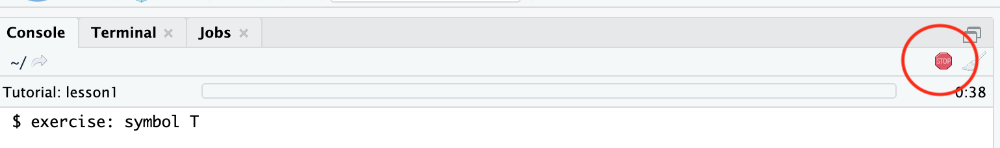
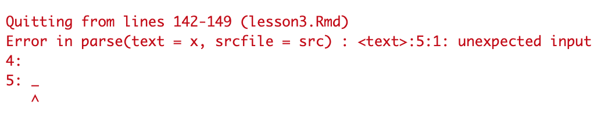
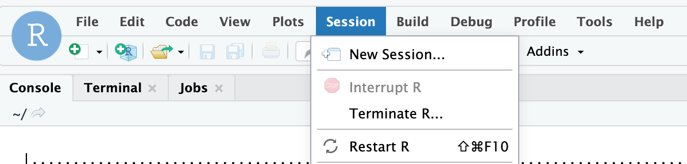
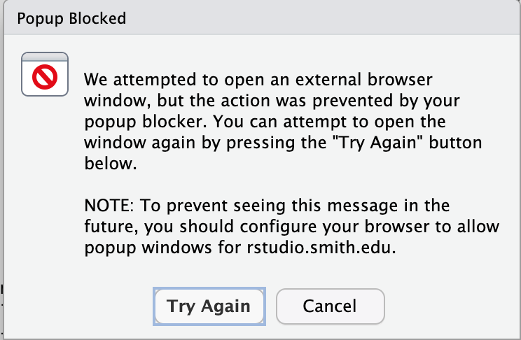

# codingTrainings
coding trainings to accompany "Stat Design for Scientific Studies" course

### To install this package:

One time only (may need to reinstall for updates throughout the semester):

`install.packages("remotes")`

`remotes::install_github("sastoudt/StatTheoryLabs", build_vignettes = T)`

### Launch a lesson:

1. In the console (bottom left) type: `learnr::run_tutorial("ct-1", "codingTutorials")`

### Stop a lesson 

1. Click stop sign on the left.

#### Troubleshooting

- If you get some kind of error having to do with "parse" when you try to run a tutorial:
 

Click "Session" --> "Restart R" and try to run the tutorial again. 

 

- The tutorial will often pop up in a new browser tab automatically. If you have a popup blocker, you might need to turn it off or update the settings.

 

## Available Tutorials

- subsets: how to subset vectors, matrices, and data frames using indices, logicals, and subset notation
- loops: how to use for loops including to simulate and store results 
- prob-dists: how to calculate probabilities and quantiles of common distributions and draw random values from them
